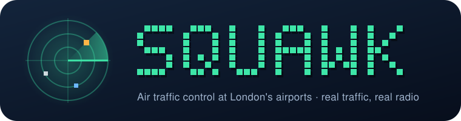
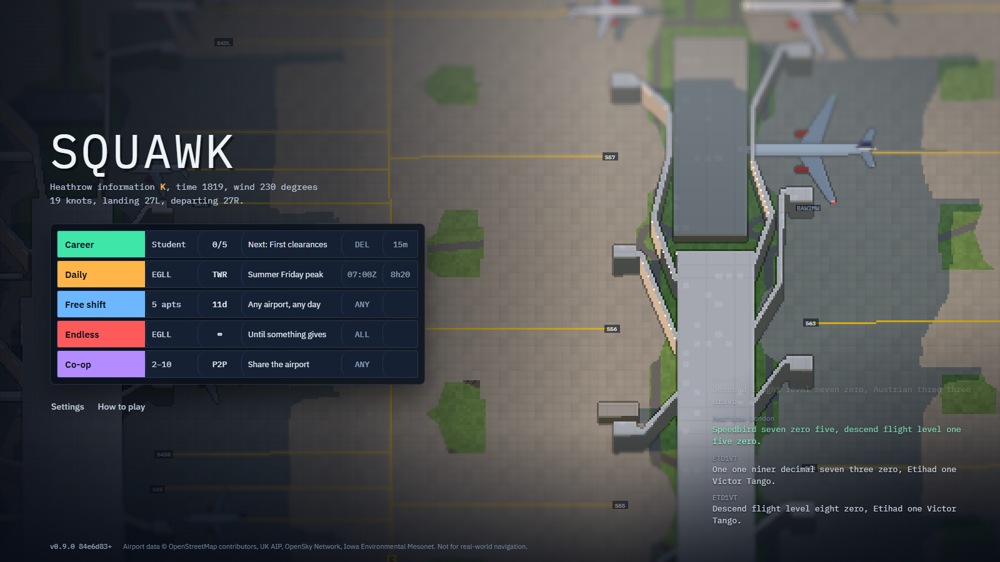
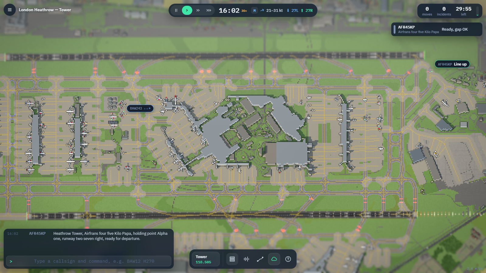
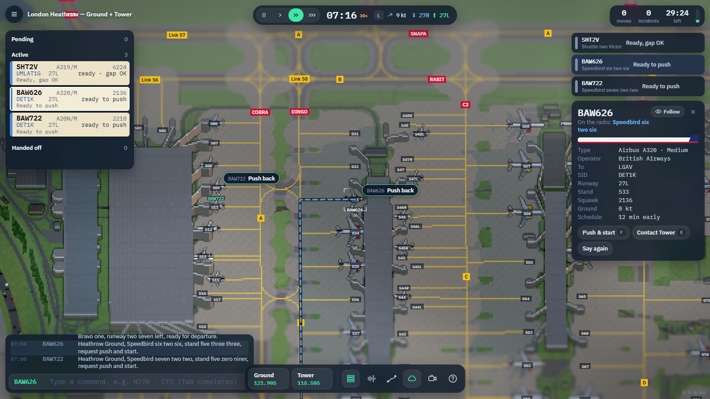
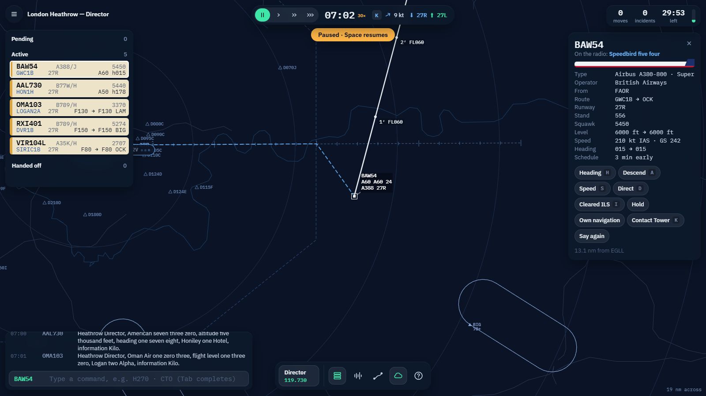
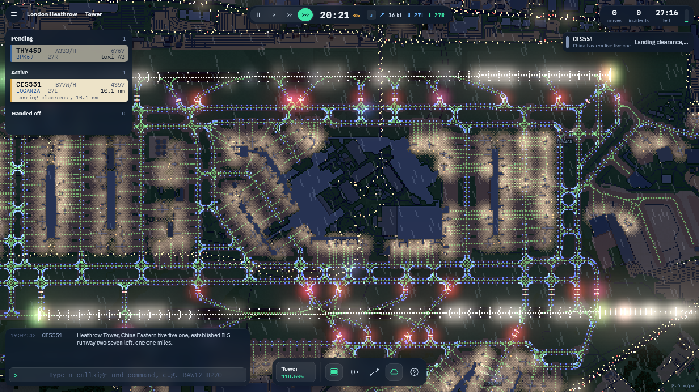
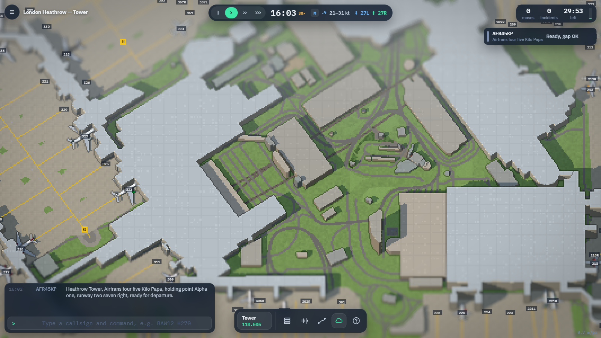
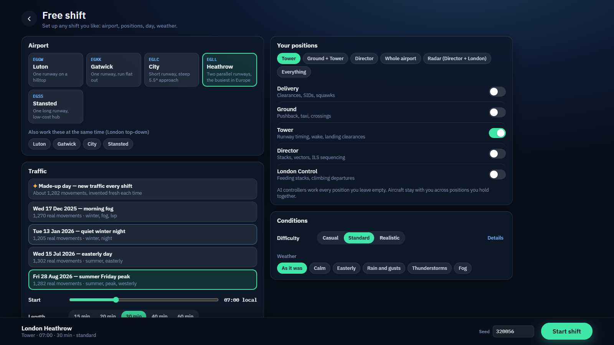
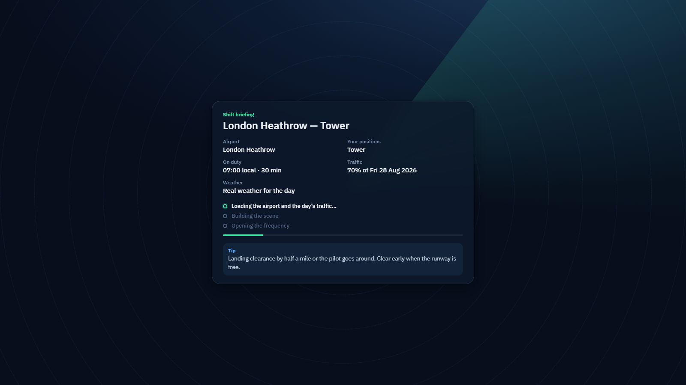

<p align="center">
  
</p>

<p align="center">
  <a href="https://github.com/Alexr03/Squawk/releases"></a>
  
  
  
  
  
</p>

<p align="center">
  <b>Work the radio at London's airports.</b><br>
  Real airport layouts, real days of traffic, real weather and real UK phraseology —<br>
  in a pixel-art airport that turns into a radar scope as you zoom out.
</p>

<p align="center">
  
</p>

---

## What is it?

Squawk is an air traffic control game that runs in your browser. You sit in the tower (or the radar room) at **Heathrow, Gatwick, Stansted, Luton or London City** and talk aircraft from stand to runway and from the holding stacks to the ground — one frequency at a time, or all of them at once.

Everything you see is built from real data: OpenStreetMap airport geometry checked against the UK AIP, real days of flights from the OpenSky Network, real METARs, and CAP 413 radio phraseology. It is realistic where it matters and approachable everywhere else: one-click action bubbles, drag-to-target gestures and an instructor in the career get you going in minutes.

## Features

<table>
  <tr>
    <td width="50%" valign="top">&nbsp;<b>Five positions, one seat or all of them</b><br>Delivery, Ground, Tower, Director and London Control. AI controllers staff every position you leave, and aircraft stay with you across positions you hold together.</td>
    <td width="50%" valign="top">&nbsp;<b>Five real London airports</b><br>Heathrow's parallel runways, Gatwick flat out on one, Stansted, Luton on its hilltop and City's steep 5.5° approach — or several at once in London top-down.</td>
  </tr>
  <tr>
    <td valign="top">&nbsp;<b>3D airport, live radar</b><br>A pixel-art airport with depth of field, shadows and night lighting that crossfades into a crisp radar scope with stacks, SIDs, STARs and data tags.</td>
    <td valign="top">&nbsp;<b>Real radio</b><br>Pilots call, read back and occasionally get it wrong. Accents follow the airline, destinations are said by city, and every exchange lands in the radio log.</td>
  </tr>
  <tr>
    <td valign="top">&nbsp;<b>Talk to them</b><br>Hold push-to-talk and speak like a controller — “Speedbird one two, turn left heading two seven zero.” Or type shortcuts (<code>H270 A40</code>), use the radial menu, or just drag.</td>
    <td valign="top">&nbsp;<b>See the plan</b><br>Select an aircraft to see its filed route against where it is really heading. Drag it anywhere and the exact new path — turns, taxi routes, ILS joins — appears before you let go.</td>
  </tr>
  <tr>
    <td valign="top">&nbsp;<b>Weather and real days</b><br>Morning fog with low-visibility procedures, easterly days, thunderstorms, the 15:00 runway swap — or a made-up day that is new every shift.</td>
    <td valign="top">&nbsp;<b>Day turns to night</b><br>An optional fast day cycle runs the clock and the sun 30× faster, so dusk falls and the airfield lights come up within a single session.</td>
  </tr>
  <tr>
    <td valign="top">&nbsp;<b>Career, daily challenge, endless</b><br>Five ratings from Trainee to Supervisor with checkrides, a daily shift that is the same for everyone with a leaderboard, and an endless mode that ramps until something gives.</td>
    <td valign="top">&nbsp;<b>Co-op</b><br>Split the airport with friends over peer-to-peer WebRTC: one on Ground, one on Tower, one on Director, handing traffic to each other.</td>
  </tr>
  <tr>
    <td valign="top">&nbsp;<b>Follow and auto camera</b><br>Lock the camera to an aircraft, or let the auto camera fly to whatever needs you next and back home when it's quiet.</td>
    <td valign="top">&nbsp;<b>Debrief and replays</b><br>Safety multiplies your score. After each shift, replay your worst moments from just before they happened — the sim is deterministic, so it plays back exactly.</td>
  </tr>
</table>

## Screenshots

<table>
  <tr>
    <td width="50%"><br><sub><b>Tower.</b> Both runways, depth of field and haze, the radio console at the bottom.</sub></td>
    <td width="50%"><br><sub><b>Ground.</b> Select an aircraft to see the route it wants; airfield signs name every taxiway.</sub></td>
  </tr>
  <tr>
    <td><br><sub><b>Director.</b> Filed route (dashed) against the projected path, a tick each minute.</sub></td>
    <td><br><sub><b>Drag to vector.</b> The turn and the next four minutes show before you let go.</sub></td>
  </tr>
  <tr>
    <td><br><sub><b>Dusk.</b> Edge and centreline lights, stand floodlights and rain.</sub></td>
    <td><br><sub><b>Up close.</b> Tilt-shift depth on the central terminal area.</sub></td>
  </tr>
  <tr>
    <td><br><sub><b>Free shift.</b> Airport, traffic day, positions, difficulty and weather.</sub></td>
    <td><br><sub><b>Briefing.</b> What you're walking into, while the airport loads.</sub></td>
  </tr>
</table>

## Positions

| Position | You handle | The skill |
| --- | --- | --- |
| **Delivery** | Clearances, SIDs, squawks | Getting every departure the right route out |
| **Ground** | Pushback, taxi, crossings, Follow the Greens | Keeping the apron moving without nose-to-nose standoffs |
| **Tower** | Line-ups, take-offs, landings | Runway timing and wake gaps, landing clearance by half a mile |
| **Director** | Stacks, vectors, the ILS | Turning a queue of holding aircraft into a 2.5–3 nm stream on final |
| **London Control** | Feeding the stacks, climbing departures | Separation at height across the terminal area |

## Controls

| | |
| --- | --- |
| **Select** | Click an aircraft or its strip (the camera flies to it), <kbd>Tab</kbd> to cycle, <kbd>N</kbd> for the most urgent |
| **Act** | Click the action bubble, right-click for the radial menu, or press the key shown on each button |
| **Drag** | From an aircraft onto a runway, holding point, stand, final approach, stack or fix — or anywhere for a heading |
| **Type** | <kbd>Enter</kbd> then e.g. `BAW12 H270 A40 S210`, `LUW`, `CTO`, `TX 27L VIA A B`, `ILS27R` |
| **Talk** | Turn on voice commands in Settings and hold <kbd>`</kbd> |
| **Camera** | Drag to pan, scroll to zoom, <kbd>V</kbd> follow the selected aircraft, <kbd>Shift</kbd>+<kbd>V</kbd> auto camera, <kbd>Shift</kbd>+<kbd>1</kbd>–<kbd>5</kbd> jump to a position |
| **Time** | <kbd>Space</kbd> pause, <kbd>1</kbd>–<kbd>5</kbd> for 1× to 5× speed |

## Getting started

You need [Node.js 24](https://nodejs.org) and [pnpm](https://pnpm.io).

```sh
git clone https://github.com/Alexr03/Squawk.git
cd Squawk
pnpm install
pnpm dev            # http://localhost:5173
```

Start with **Career** — the instructor walks you through each position — or open **How to play** from the home screen.

### Build and test

```sh
pnpm typecheck      # TypeScript across all packages
pnpm test           # Vitest: sim (incl. golden replay), phraseology round-trips, pipeline validation, day packs
pnpm build          # static site in apps/web/dist
node tools/simrun.ts EGLL-2026-08-28 7 60 1   # headless all-AI shift: day, start hour (UTC), minutes, traffic share
node tools/careercheck.ts                     # every career shift and a week of dailies: are there enough calls?
```

## Versioning

Squawk follows [Semantic Versioning](https://semver.org) with an automatic patch number. `package.json` holds the major and minor version; the patch number is the count of commits since that version was set, and the build commit follows a `+`, as in `0.9.16+84e6d83`. It is shown on the home screen, in **Settings → About** and in the pause menu.

- **MAJOR** — changes that break saved progress or shared replays
- **MINOR** — new features, airports, positions or content
- **PATCH** — automatic: every commit since the last minor or major

Start a new version with `pnpm release minor` (or `major`): it sets `package.json`, opens a section in [CHANGELOG.md](CHANGELOG.md), commits and tags `vX.Y.0`. Push with `git push --follow-tags`. Patch numbers then count up by themselves.

## Deploying

The game is a static site; nothing runs on a server for single-player.

1. **Cloudflare Pages** → create a project from this repo. Build command `pnpm build`, output directory `apps/web/dist`, Node 24.
2. **Custom domain** → add it to the Pages project.
3. **Optional**, for the daily leaderboard and co-op room codes: deploy the Worker in `apps/leaderboard` (see its README) and set `VITE_LEADERBOARD_URL` in the Pages build environment. Without it the leaderboard is per-device and co-op uses copy-paste invite codes.

## Project layout

| Path | What |
| --- | --- |
| `packages/sim` | Deterministic simulation (4 Hz, seeded): traffic, physics, pilots, AI controllers, rules, scoring |
| `packages/phraseology` | CAP 413 text and speech, typed shortcuts, voice grammar, place names |
| `packages/render` | Three.js pixel-art airport, post-processing and the radar scope |
| `apps/web` | Svelte 5 game client: HUD, menus, audio, voice input, co-op |
| `apps/leaderboard` | Cloudflare Worker: daily leaderboard and co-op signalling |
| `tools/pipeline` | Builds airport packs (OSM + AIP) and day packs (OpenSky + METAR) |
| `data/` | Baked airport and day packs |

[PLAN.md](PLAN.md) is the design spec, [DECISIONS.md](DECISIONS.md) records the choices made while building it, and [PROGRESS.md](PROGRESS.md) tracks the milestones.

## Data and attribution

Rebuild an airport pack with `node tools/pipeline/airport.ts EGLL`. Baking a traffic day needs OpenSky API credentials in `credentials.json` at the repo root (git-ignored, never shipped): `node tools/pipeline/traffic.ts EGLL 2026-08-28 --label "..." --tags summer,peak`. See `tools/pipeline/README.md`.

Airport geometry © [OpenStreetMap](https://www.openstreetmap.org/copyright) contributors (ODbL) · UK AIP via NATS AIS · Traffic from [The OpenSky Network](https://opensky-network.org) · METARs from the [Iowa Environmental Mesonet](https://mesonet.agron.iastate.edu) · Coastline from Natural Earth.

<p align="center"><sub>Squawk is a game. It is not for real-world navigation or air traffic control.</sub></p>
